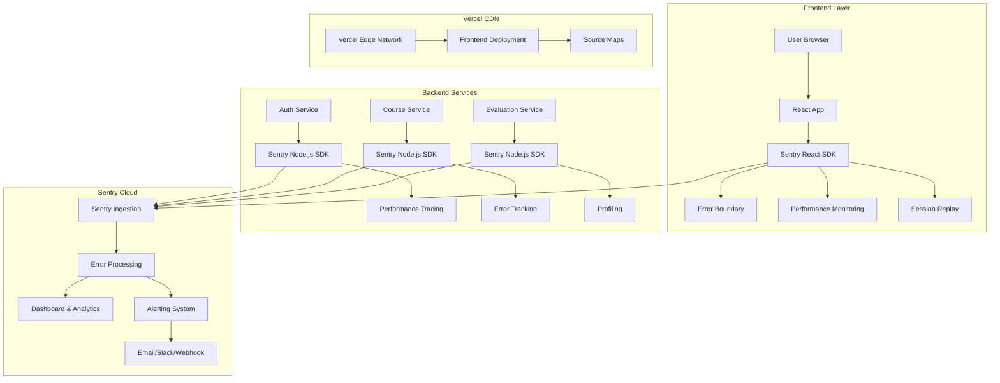
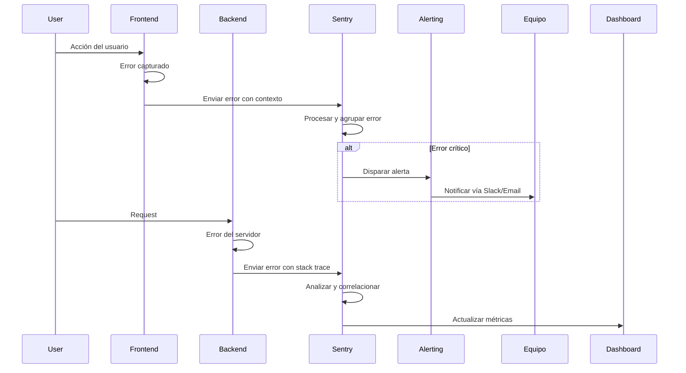
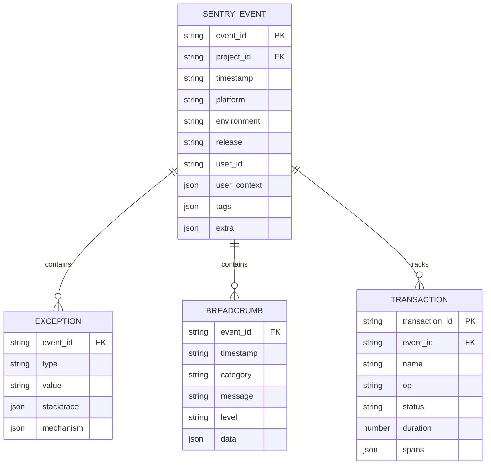

# Documento de Arquitectura Técnica - Integración de Sentry

## 1. Diseño de Arquitectura con Sentry

### 1.1 Diagrama de Arquitectura Completa



### 1.2 Flujo de Datos de Error



## 2. Stack Tecnológico Actualizado

### 2.1 Frontend Stack
- **Framework**: React@18 + Vite
- **UI**: TailwindCSS + Framer Motion
- **Routing**: React Router DOM
- **HTTP Client**: Axios
- **Sentry**: @sentry/react + @sentry/vite-plugin

### 2.2 Backend Services Stack
- **Runtime**: Node.js
- **Framework**: Express.js
- **Database**: PostgreSQL
- **Auth**: JWT + Google OAuth
- **Sentry**: @sentry/node + @sentry/profiling-node

### 2.3 Servicios Externos
- **Sentry**: Error tracking y performance monitoring
- **Vercel**: Hosting y deployment
- **Cloudinary**: Gestión de imágenes
- **Neon**: PostgreSQL hosting

## 3. Configuración de Rutas y Endpoints

### 3.1 Frontend Routes

| Ruta | Propósito | Sentry Integration |
|------|-----------|-------------------|
| `/` | Home page | Page load tracking |
| `/login` | Authentication | Error boundary |
| `/courses` | Course listing | Performance monitoring |
| `/course/:id` | Course details | User interaction tracking |
| `/evaluations` | Student evaluations | Session replay |
| `/admin/*` | Admin dashboard | Enhanced error tracking |

### 3.2 Backend API Endpoints

#### Auth Service (Port 3001)
```
POST /api/auth/login          - Authentication tracking
POST /api/auth/register       - User registration errors
POST /api/auth/refresh        - Token refresh monitoring
GET  /api/auth/profile        - Profile access tracking
```

#### Course Service (Port 3002)
```
GET  /api/courses             - Course listing performance
POST /api/courses             - Course creation tracking
GET  /api/courses/:id         - Course detail errors
PUT  /api/courses/:id         - Update tracking
DELETE /api/courses/:id       - Deletion monitoring
```

#### Evaluation Service (Port 3003)
```
GET  /api/evaluations         - Test listing errors
POST /api/evaluations         - Test creation tracking
POST /api/evaluations/submit  - Submission monitoring
GET  /api/evaluations/results - Results performance
```

## 4. Modelo de Datos de Sentry

### 4.1 Event Structure



### 4.2 Context Data Schema

```typescript
interface SentryContext {
  user: {
    id: string;
    email: string;
    role: 'student' | 'teacher' | 'admin';
    plan?: 'free' | 'premium';
  };
  app: {
    name: string;
    version: string;
    build: string;
  };
  server: {
    hostname: string;
    runtime: string;
    runtime_version: string;
  };
  tags: {
    service: string;
    endpoint: string;
    method: string;
    [key: string]: string;
  };
}
```

## 5. Configuración de Seguridad

### 5.1 Data Scrubbing

```javascript
// src/utils/sentry-scrubber.js
export function scrubSensitiveData(event) {
  // Remove PII
  if (event.request?.headers) {
    delete event.request.headers.authorization;
    delete event.request.headers.cookie;
  }
  
  // Scrub request data
  if (event.request?.data) {
    const sensitiveKeys = ['password', 'token', 'secret', 'ssn', 'credit_card'];
    event.request.data = scrubObject(event.request.data, sensitiveKeys);
  }
  
  return event;
}

function scrubObject(obj, sensitiveKeys) {
  if (!obj || typeof obj !== 'object') return obj;
  
  const scrubbed = { ...obj };
  for (const key in scrubbed) {
    if (sensitiveKeys.some(sk => key.toLowerCase().includes(sk))) {
      scrubbed[key] = '[REDACTED]';
    } else if (typeof scrubbed[key] === 'object') {
      scrubbed[key] = scrubObject(scrubbed[key], sensitiveKeys);
    }
  }
  
  return scrubbed;
}
```

### 5.2 Rate Limiting

```javascript
// Rate limiting for Sentry events
const rateLimiter = new Map();

export function shouldSendEvent(event) {
  const key = `${event.user?.id || 'anonymous'}-${event.exception?.type}`;
  const now = Date.now();
  const window = 60000; // 1 minute
  const limit = 5; // Max 5 errors per minute
  
  if (!rateLimiter.has(key)) {
    rateLimiter.set(key, []);
  }
  
  const timestamps = rateLimiter.get(key).filter(ts => now - ts < window);
  
  if (timestamps.length >= limit) {
    return false; // Drop the event
  }
  
  timestamps.push(now);
  rateLimiter.set(key, timestamps);
  
  return true;
}
```

## 6. Performance Monitoring Configuration

### 6.1 Web Vitals Tracking

```javascript
// Frontend performance tracking
import { getCLS, getFID, getFCP, getLCP, getTTFB } from 'web-vitals';

function sendToSentry(metric) {
  Sentry.captureMessage('Web Vital', {
    level: 'info',
    tags: {
      metric_name: metric.name,
      metric_value: Math.round(metric.value),
      rating: metric.rating,
    },
    extra: metric,
  });
}

getCLS(sendToSentry);
getFID(sendToSentry);
getFCP(sendToSentry);
getLCP(sendToSentry);
getTTFB(sendToSentry);
```

### 6.2 Database Query Monitoring

```javascript
// PostgreSQL query monitoring
const originalQuery = pg.Client.prototype.query;

pg.Client.prototype.query = function(...args) {
  const transaction = Sentry.getCurrentHub().getScope().getTransaction();
  
  if (transaction) {
    const span = transaction.startChild({
      op: 'db',
      description: args[0].text || args[0],
    });
    
    const startTime = Date.now();
    
    const result = originalQuery.apply(this, args);
    
    if (result.then) {
      result.then(() => {
        span.setTag('db.duration', Date.now() - startTime);
        span.finish();
      }).catch(() => {
        span.setStatus('internal_error');
        span.finish();
      });
    }
    
    return result;
  }
  
  return originalQuery.apply(this, args);
};
```

## 7. Deployment Configuration

### 7.1 Vercel Configuration

**Frontend vercel.json:**
```json
{
  "buildCommand": "npm run build",
  "outputDirectory": "dist",
  "env": {
    "VITE_SENTRY_DSN": "@sentry-dsn-frontend",
    "VITE_SENTRY_ORG": "@sentry-org",
    "VITE_SENTRY_PROJECT": "@sentry-project-frontend",
    "VITE_SENTRY_AUTH_TOKEN": "@sentry-auth-token"
  },
  "headers": [
    {
      "source": "/(.*)",
      "headers": [
        {
          "key": "Document-Policy",
          "value": "js-profiling"
        }
      ]
    }
  ]
}
```

### 7.2 Service Deployment

**Backend services vercel.json:**
```json
{
  "functions": {
    "src/server.js": {
      "maxDuration": 30
    }
  },
  "env": {
    "SENTRY_DSN": "@sentry-dsn-service",
    "NODE_ENV": "production"
  }
}
```

## 8. Monitoring y Alertas

### 8.1 Alert Configuration

```yaml
# sentry-alerts.yml
alerts:
  - name: "High Error Rate"
    conditions:
      - error_rate > 5%
      - duration: 5m
    actions:
      - send_slack: "#alerts-sentry"
      - send_email: "dev-team@eduplus.com"
  
  - name: "Slow Response Time"
    conditions:
      - p95_response_time > 2000ms
      - duration: 10m
    actions:
      - send_slack: "#performance-alerts"
  
  - name: "New Error Type"
    conditions:
      - new_error_type: true
    actions:
      - create_jira_ticket: true
      - assign_to: "on-call-engineer"
```

### 8.2 Dashboard Metrics

Key metrics to monitor:
- Error rate by service
- Response time percentiles (P50, P95, P99)
- Session replay count
- User impact score
- Release health metrics

## 9. Testing Strategy

### 9.1 Integration Tests

```javascript
// tests/sentry-integration.test.js
describe('Sentry Integration', () => {
  test('should capture and send errors', async () => {
    const mockError = new Error('Test error');
    
    // Mock Sentry capture
    const captureSpy = jest.spyOn(Sentry, 'captureException');
    
    // Trigger error
    await simulateError(mockError);
    
    expect(captureSpy).toHaveBeenCalledWith(mockError);
  });
  
  test('should filter sensitive data', () => {
    const event = {
      request: {
        data: {
          password: 'secret123',
          email: 'user@example.com'
        }
      }
    };
    
    const scrubbed = scrubSensitiveData(event);
    
    expect(scrubbed.request.data.password).toBe('[REDACTED]');
    expect(scrubbed.request.data.email).toBe('user@example.com');
  });
});
```

### 9.2 Load Testing

```javascript
// Load test configuration
export const loadTestConfig = {
  stages: [
    { duration: '2m', target: 100 },
    { duration: '5m', target: 500 },
    { duration: '2m', target: 0 },
  ],
  thresholds: {
    http_req_duration: ['p(95)<2000'],
    errors: ['rate<0.1'],
  },
  ext: {
    sentry: {
      monitor_performance: true,
      capture_errors: true,
    },
  },
};
```

---

Esta arquitectura técnica proporciona una integración completa y segura de Sentry con tu plataforma EduPlus Academy, asegurando monitoreo efectivo de errores y rendimiento en todos los componentes del sistema.